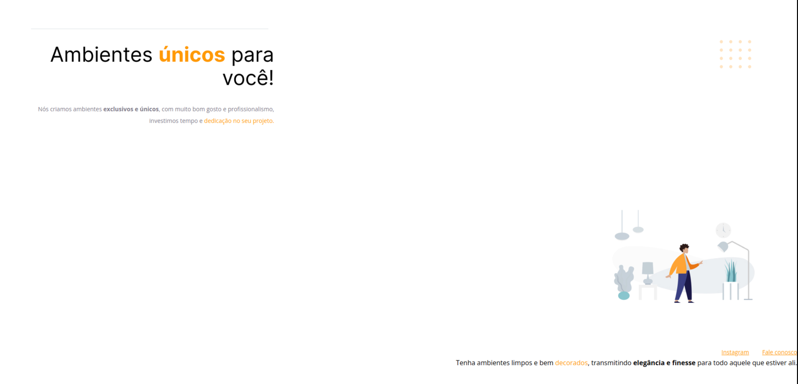
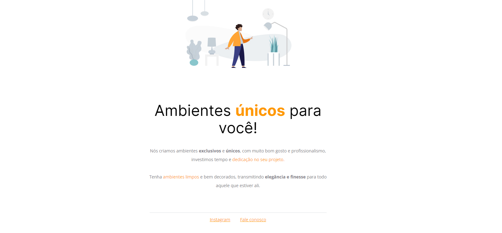

### Desafio do Stage 02 - Ambientes

A Rocketseat passou um projeto com erros propositais para que se realize as correções do projeto.

Técnicas aplicadas:

- Estrutura de um projeto HTML;
- Uso de tags HTML comuns;
- Conseito de CSS;
- Posicionamento e alinhamento de elementos na tela;
- Aplicação de fontes customizadas;
- Espaçamentos.

Abaixo está a imagem de como se encontrava o projeto e como ficou.
 